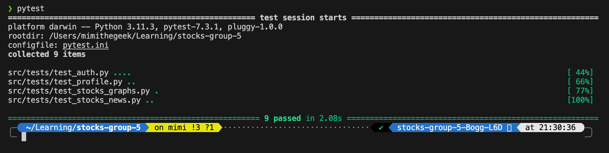

# stocks-group-5

## Pre-requisites

If you can install pipenv, its better but you can skip this step if you want. 
> **brew only works with mac**
> for windows, maybe follow this https://www.jetbrains.com/help/pycharm/pipenv.html 

```bash
> brew install pipenv 
> pipenv --python 3.11
> pipenv shell
> pip install -r requirements.txt
```

To exit pipenv - write `exit` on your terminal.

## To run the app: 

```bash
> pipenv shell

> flask run
```

## To create a feature branch

```bash
git checkout -b feature/feature-branch-name base-branch
```

## PyTest Coverage

